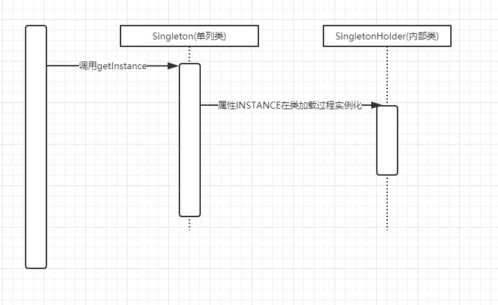

1、单例模式的常见写法。

2、每种单例写法的优、缺点。

3、破坏单例模式的方式有哪些?。

4、梳理内部类的执行逻辑，并画出时序图。

---  
#### 单例模式的常见写法  
code
#### 每种单例写法的优、缺点  
- 饿汉式单例  
    - 优点：没有加锁，执行效率会提高。
    - 缺点：类加载时就初始化，浪费内存(看实例大不大)
- 懒汉式单例  
    - 优点：第一次调用才初始化，避免内存浪费。
    - 缺点：必须加锁 synchronized 才能保证单例，但加锁会影响效率。 
- 双重校验锁  
    - 优点：第一次调用才初始化，避免内存浪费。   
    - 缺点：第一次new实例时耗时过长，并发时影响程序性能
- 静态内部类  
    - 和双重校验类似
- 枚举/注册式单例  
    - 优点：自动支持序列化机制，防止反序列化重新创建新的对象，绝对防止多次实例化  
#### 破坏单例模式的方式有哪些  
###### 1、反射破坏单例  
解决方案:  
- 在构造器中加一个判断(com.fll.esign.model.inner.Singleton)  
- 使用枚举/注册式单例 
###### 2、序列化破坏单例   
解决方案:  
- 加一个私有readResolve()方法，当JVM从内存中反序列化地"组装"一个新对象时，就会自动调用这个 readResolve方法来返回我们指定好的对象了  
- 使用枚举/注册式单例  
#### 梳理内部类的执行逻辑，并画出时序图  

顺序是：父类静态属性-》父类静态代码块-》子类静态变量-》子类静态代码块-》父类非静态变量-》父类非静态代码块-》父类构造函数-》子类非静态变量-》子类非静态代码块-》-》子类构造函数  
这样的加载顺序不是绝对的 因为静态变量和静态代码块跟声明顺序有关。 
